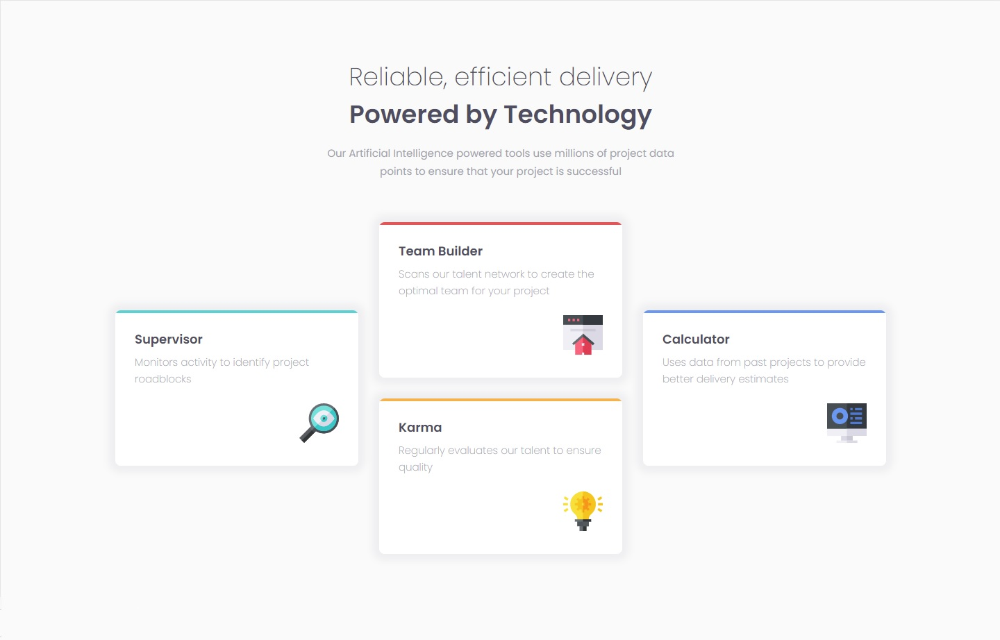

# Frontend Mentor - Four card feature section solution

This is a solution to the [Four card feature section challenge on Frontend Mentor](https://www.frontendmentor.io/challenges/four-card-feature-section-weK1eFYK). Frontend Mentor challenges help you improve your coding skills by building realistic projects. 

## Table of contents

- [Overview](#overview)
  - [The challenge](#the-challenge)
  - [Screenshot](#screenshot)
  - [Links](#links)
- [My process](#my-process)
  - [Built with](#built-with)
  - [What I learned](#what-i-learned)
  - [Continued development](#continued-development)
  - [Useful resources](#useful-resources)
- [Author](#author)
## Overview

### The challenge

Users should be able to:

- View the optimal layout for the site depending on their device's screen size

### Screenshot

### Links

- Solution URL: [Solution here](https://github.com/cervantesdeveloper/fem10.git)
- Live Site URL: [Live site here](https://fem10.netlify.app/)

## My process

### Built with

- Semantic HTML5 markup
- CSS custom properties
- Flexbox
- CSS Grid
- Mobile-first workflow

### What I learned

I had a while without using CSS grid, it was great to use it again.

### Continued development

I need more practice on the CSS grid, I hope to use it in the next challenges.

### Useful resources

- [mdn web docs](https://developer.mozilla.org/es/docs/Web/CSS/CSS_Grid_Layout) - This helped me remember the basics of the CSS grid.

## Author

- Frontend Mentor - [@cervantesdeveloper](https://www.frontendmentor.io/profile/cervantesdeveloper)
- Github - [cervantesdeveloper](https://github.com/cervantesdeveloper)
